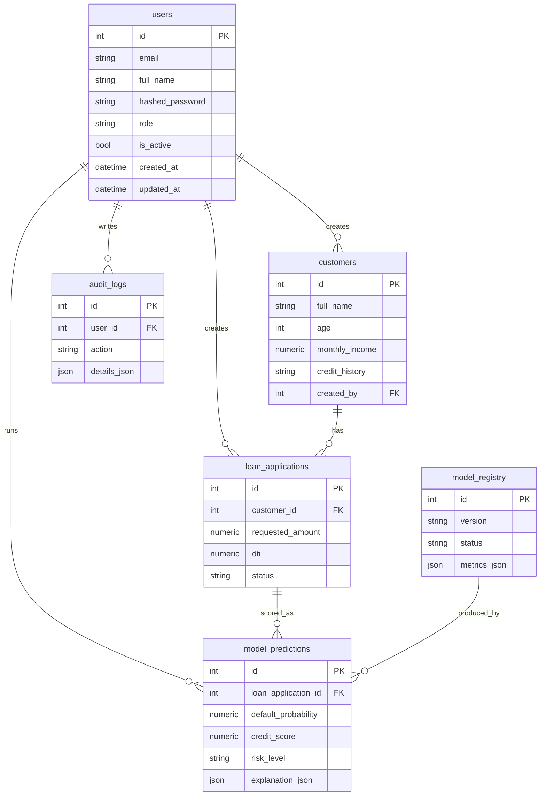

# Sơ đồ thực thể liên kết (ERD)

```mermaid
erDiagram
  users ||--o{ customers : creates
  users ||--o{ loan_applications : creates
  users ||--o{ model_predictions : runs
  users ||--o{ audit_logs : writes
  customers ||--o{ loan_applications : has
  loan_applications ||--o{ model_predictions : scored_as
  model_registry ||--o{ model_predictions : produced_by

  users {
    int id PK
    string email
    string full_name
    string hashed_password
    string role
    bool is_active
    datetime created_at
    datetime updated_at
  }
  customers {
    int id PK
    string full_name
    int age
    numeric monthly_income
    string credit_history
    int created_by FK
  }
  loan_applications {
    int id PK
    int customer_id FK
    numeric requested_amount
    numeric dti
    string status
  }
  model_predictions {
    int id PK
    int loan_application_id FK
    numeric default_probability
    numeric credit_score
    string risk_level
    json explanation_json
  }
  model_registry {
    int id PK
    string version
    string status
    json metrics_json
  }
  audit_logs {
    int id PK
    int user_id FK
    string action
    json details_json
  }
```

Index: `loan_applications(customer_id, status, created_at)`, `model_predictions(risk_level, created_at)`, `customers(created_at)`.
