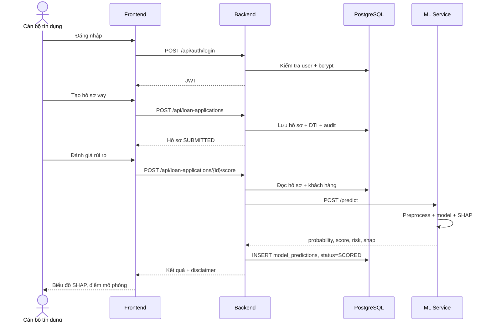

# Sequence diagram: đánh giá hồ sơ vay

```mermaid
sequenceDiagram
  actor Officer as Cán bộ tín dụng
  participant UI as Frontend
  participant API as Backend
  participant DB as PostgreSQL
  participant ML as ML Service

  Officer->>UI: Đăng nhập
  UI->>API: POST /api/auth/login
  API->>DB: Kiểm tra user + bcrypt
  API-->>UI: JWT

  Officer->>UI: Tạo hồ sơ vay
  UI->>API: POST /api/loan-applications
  API->>DB: Lưu hồ sơ + DTI + audit
  API-->>UI: Hồ sơ SUBMITTED

  Officer->>UI: Đánh giá rủi ro
  UI->>API: POST /api/loan-applications/{id}/score
  API->>DB: Đọc hồ sơ + khách hàng
  API->>ML: POST /predict
  ML->>ML: Preprocess + model + SHAP
  ML-->>API: probability, score, risk, shap
  API->>DB: INSERT model_predictions, status=SCORED
  API-->>UI: Kết quả + disclaimer
  UI-->>Officer: Biểu đồ SHAP, điểm mô phỏng
```
